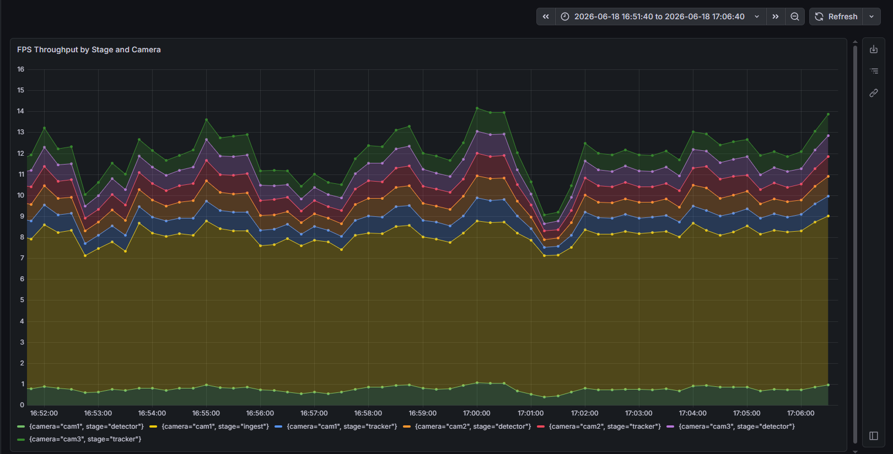
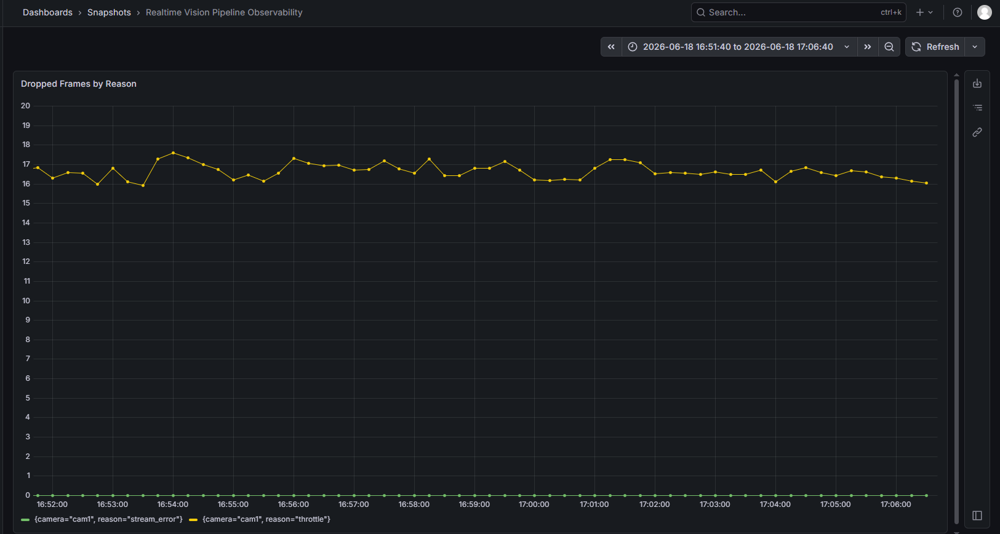
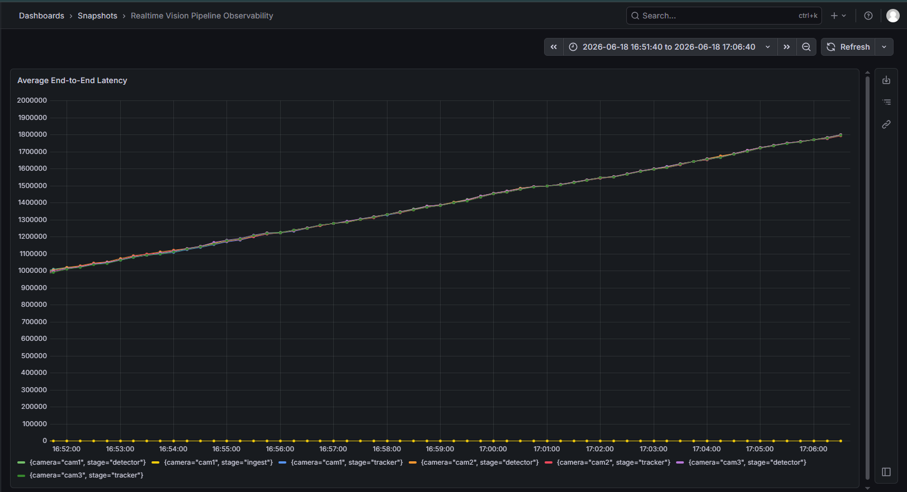
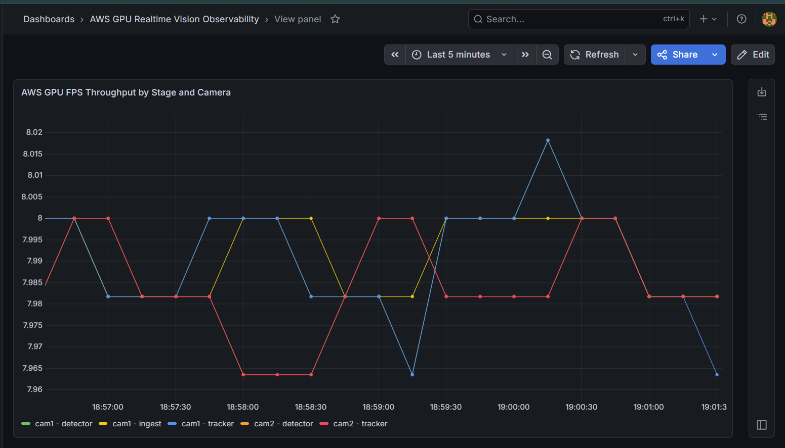
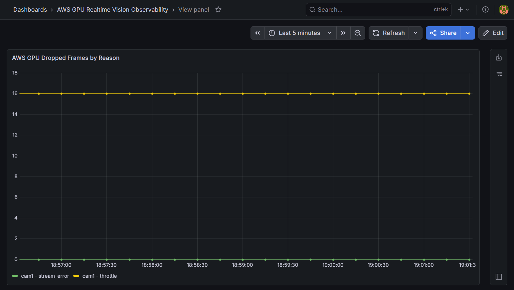
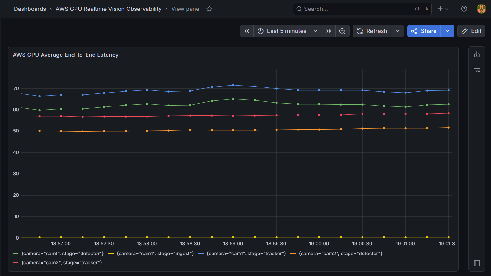
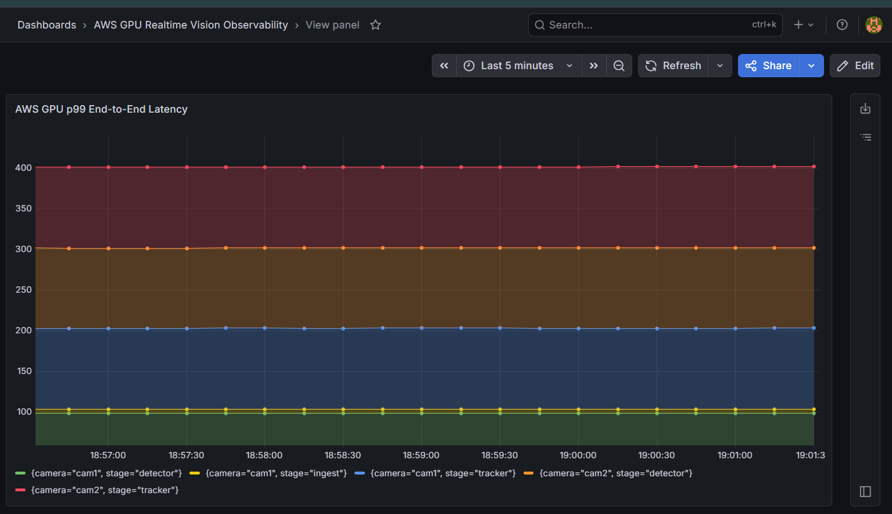

# Realtime Vision Pipeline

### Multi-Camera Object Detection, Tracking, GPU Inference, and Observability

A distributed real-time computer vision system that ingests multiple RTSP camera streams, performs object detection with YOLOv8, tracks objects across frames, and streams live results to a browser dashboard. The pipeline uses Kafka as the event backbone, NVIDIA Triton for model serving, and Prometheus/Grafana for end-to-end observability.

This project was built to answer one practical question:

> Can a multi-camera vision pipeline stay live, observable, and recoverable under real-time load?

---

## Highlights

* Built a multi-service streaming pipeline for real-time object detection and tracking.
* Simulated 3 camera feeds using FFmpeg and RTSP through MediaMTX.
* Used Kafka topics to decouple ingestion, detection, tracking, and dashboard rendering.
* Integrated YOLOv8n detection through NVIDIA Triton Inference Server.
* Ran GPU-backed inference on AWS EC2 `g4dn.xlarge` with NVIDIA Tesla T4.
* Added Prometheus metrics and Grafana dashboards for throughput, dropped frames, p95/p99 latency, and average end-to-end latency.
* Captured benchmark evidence comparing local CPU behavior and AWS GPU behavior.
* Added dashboard proof, GPU utilization proof, Triton logs, detector logs, and observability screenshots.

---

## System Architecture

```text
MP4 traffic videos
   ↓
FFmpeg RTSP publishers
   ↓
MediaMTX RTSP server
   ↓
Ingest workers
   ↓
Kafka topic: frames
   ↓
Detector service
   ↓
YOLOv8n via NVIDIA Triton
   ↓
Kafka topic: detections
   ↓
Tracker service
   ↓
Kafka topic: tracks
   ↓
FastAPI WebSocket API
   ↓
Live browser dashboard
   ↓
Prometheus + Grafana observability
```

Each frame carries a `captured_ts` timestamp from ingest. Downstream services use this timestamp to calculate end-to-end latency at each stage.

---

## What This Demonstrates

This project is not just a computer vision demo. It demonstrates backend and distributed-systems skills that matter in production systems:

| Area                  | What this project shows                                                         |
| --------------------- | ------------------------------------------------------------------------------- |
| Streaming systems     | Kafka-based event pipeline with frame, detection, and track topics              |
| Computer vision       | YOLOv8 object detection on traffic-scene video streams                          |
| Model serving         | NVIDIA Triton used as a dedicated inference backend                             |
| GPU deployment        | AWS Tesla T4 GPU run with `tritonserver` verified through `nvidia-smi`          |
| Observability         | Prometheus counters and histograms, Grafana dashboards                          |
| Performance debugging | p95/p99 latency, dropped frames, FPS throughput, backlog behavior               |
| System design         | Clear separation of ingest, detection, tracking, API, metrics, and dashboard    |
| Reliability           | Services can be restarted independently because Kafka decouples pipeline stages |

---

## Tech Stack

| Layer            | Tools                                  |
| ---------------- | -------------------------------------- |
| Video simulation | FFmpeg, RTSP                           |
| RTSP server      | MediaMTX                               |
| Messaging        | Apache Kafka                           |
| Detection        | YOLOv8n                                |
| Model serving    | NVIDIA Triton Inference Server         |
| Tracking         | SORT-style object tracking             |
| API              | FastAPI, WebSockets                    |
| Dashboard        | HTML/Canvas live browser view          |
| Observability    | Prometheus, Grafana                    |
| Deployment       | Docker Compose                         |
| GPU benchmark    | AWS EC2 `g4dn.xlarge`, NVIDIA Tesla T4 |

---

## Live Dashboard

The browser dashboard shows live detections and tracks from multiple camera streams.

Example detected classes include:

* `car`
* `truck`
* `bus`
* `person`
* `traffic light`
* `stop sign`

Each camera tile displays live bounding boxes, labels, tracking IDs, and end-to-end latency.

---

## Observability

Prometheus metrics are emitted from pipeline services on port `9100`.

Tracked metrics include:

| Metric                          | Purpose                                           |
| ------------------------------- | ------------------------------------------------- |
| `pipeline_frames_total`         | Frames processed by stage and camera              |
| `pipeline_frames_dropped_total` | Frames dropped due to throttling or stream errors |
| `pipeline_e2e_latency_ms`       | End-to-end latency from capture to each stage     |
| `pipeline_stage_processing_ms`  | Processing time inside each service stage         |

Grafana dashboards visualize:

* FPS throughput by stage and camera
* Dropped frames by reason
* Average end-to-end latency
* p95 end-to-end latency
* p99 end-to-end latency

---

## Benchmark Evidence

Benchmark artifacts are stored under:

```text
docs/benchmarks/
docs/assets/
```

### Local CPU Observability

The local CPU run was used to expose backlog behavior under higher frame rates.







### AWS GPU Observability

The AWS GPU run used NVIDIA Triton on a Tesla T4 GPU.










---

## Benchmark Summary

| Scenario      | Environment             | Cameras | Target FPS per Camera | Total Target FPS | Inference Backend      |
| ------------- | ----------------------- | ------: | --------------------: | ---------------: | ---------------------- |
| Local CPU run | Windows laptop + Docker |       3 |            1 / 10 FPS |       3 / 30 FPS | Triton / CPU           |
| AWS GPU run   | EC2 g4dn.xlarge         |       3 |                10 FPS |           30 FPS | Triton / NVIDIA T4 GPU |

Key observation:

> The local CPU run showed backlog and rising latency under higher load, while the AWS GPU run demonstrated lower visible dashboard latency and GPU-backed Triton inference under the same multi-camera setup.

---

## Quickstart

### 1. Clone the repository

```bash
git clone https://github.com/Sharayu1418/RealTimeComputerVisionPipeline.git
cd RealTimeComputerVisionPipeline
```

### 2. Create environment file

```bash
cp .env.example .env
```

Example `.env`:

```env
KAFKA_BOOTSTRAP=kafka:9092
RTSP_URL=rtsp://mediamtx:8554/cam1
CAMERA_ID=cam1
FRAME_WIDTH=640
TARGET_FPS=10
MODEL_NAME=yolov8n.pt
CONF_THRESHOLD=0.35
DETECTOR_BACKEND=triton
TRITON_URL=triton:8001
```

### 3. Start the pipeline

```bash
docker compose up -d kafka mediamtx triton prometheus grafana
docker compose up -d detector tracker api ingest ingest2 ingest3
```

### 4. Start camera streams

```bash
ffmpeg -re -stream_loop -1 -i videos/cam1.mp4 -an -c:v copy -f rtsp -rtsp_transport tcp rtsp://127.0.0.1:8554/cam1
ffmpeg -re -stream_loop -1 -i videos/cam2.mp4 -an -c:v copy -f rtsp -rtsp_transport tcp rtsp://127.0.0.1:8554/cam2
ffmpeg -re -stream_loop -1 -i videos/cam3.mp4 -an -c:v copy -f rtsp -rtsp_transport tcp rtsp://127.0.0.1:8554/cam3
```

### 5. Open dashboards

```text
Live dashboard: http://localhost:8000
Prometheus:     http://localhost:9090
Grafana:        http://localhost:3000
```

---

## Useful Prometheus Queries

### FPS throughput

```promql
sum(rate(pipeline_frames_total[1m])) by (stage, camera)
```

### Dropped frames

```promql
sum(rate(pipeline_frames_dropped_total[1m])) by (reason, camera)
```

### p95 end-to-end latency

```promql
histogram_quantile(0.95, sum(rate(pipeline_e2e_latency_ms_bucket[5m])) by (le, stage, camera))
```

### p99 end-to-end latency

```promql
histogram_quantile(0.99, sum(rate(pipeline_e2e_latency_ms_bucket[5m])) by (le, stage, camera))
```

### Average end-to-end latency

```promql
sum(rate(pipeline_e2e_latency_ms_sum[5m])) by (stage, camera)
/
sum(rate(pipeline_e2e_latency_ms_count[5m])) by (stage, camera)
```

---

## Repository Map

| Path                        | Purpose                                       |
| --------------------------- | --------------------------------------------- |
| `common/schemas.py`         | Shared message contracts between services     |
| `common/kafka_io.py`        | Kafka producer and consumer setup             |
| `common/metrics.py`         | Prometheus counters and histograms            |
| `services/ingest/`          | RTSP decode, throttling, and frame publishing |
| `services/detector/`        | YOLOv8/Triton detection service               |
| `services/tracker/`         | Object tracking from detections to tracks     |
| `services/api/`             | WebSocket API and browser dashboard           |
| `monitoring/prometheus.yml` | Prometheus scrape configuration               |
| `docs/benchmarks/`          | Benchmark reports and logs                    |
| `docs/assets/`              | Dashboard screenshots and evidence            |

---

## Current Project Status

Completed:

* Multi-camera RTSP simulation
* Kafka streaming pipeline
* YOLOv8n object detection
* Tracker output visualization
* Live WebSocket dashboard
* Triton inference backend
* AWS GPU deployment
* Prometheus/Grafana observability
* CPU vs AWS GPU benchmark evidence

In progress / future improvements:

* Add labeled-frame model evaluation
* Report precision, recall, and mAP@0.5
* Add stale-frame dropping to prioritize newest frames during backlog
* Add TensorRT / FP16 optimization
* Compare SORT and ByteTrack on identical footage
* Add automated benchmark scripts

---

## Why This Project Matters

Real-time AI systems are not only about running a model. They require:

* ingesting continuous data,
* handling backpressure,
* preserving ordering,
* measuring latency,
* debugging distributed services,
* serving models efficiently,
* and proving behavior under load.

This project brings those pieces together in one working system.
